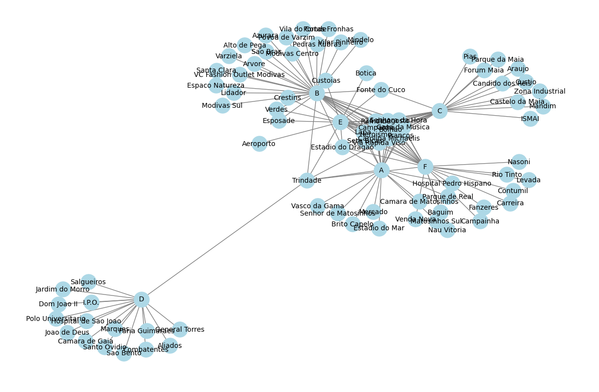

# Porto Underground Data Analysis


This is a project for the Programming 2 course proposed by the Faculdade de Ciências da Universidade do Porto, aimed at analyzing data from the Porto Underground.
<br> 
The project is divided into two tasks. The first task aims to create a GeoJSON file, while the second task involves answering questions related to the underground stations and lines using the `NetworkX` library.

## Dataset
For this project, a dataset containing information about the Porto Underground network was considered. The dataset is openly available in [this link](https://opendata.porto.digital/ne/dataset/horarios-paragens-e-rotas-em-formato-gtfs), and with a copy of the most relevant files in the folder [underground](metro).

## Task 1

The proposed task consists of generating a GeoJSON file that geographically represents the lines and stations of the Porto Underground, facilitating data visualization. GeoJSON is a valid JSON format that follows a specific structure to represent geographic features and their associated metadata. A basic example of a point in GeoJSON is:
```python
{
    "type": "FeatureCollection", 
    "features": [
        {
            "geometry": {
                "type": "Point", 
                "coordinates": [
                    float with the longitude value, 
                    float with the latitude value
                ]
            }, 
            "type": "Feature", 
            "properties": a dictionary with the meta-information associated with the geographic point
            }
        }]
}
```
  
### Steps for Task 1
  
1. Read each file from the dataset into a separate DataFrame and combine the data into a single DataFrame.
2. Represent each station as a point on the map, with additional properties such as the station name.
3. Represent each underground line as a set of line segments on the map, considering that the path between two stations is a straight line. The color of the segment is adjusted to be consistent with the color of the corresponding underground line name.
4. After representing the stations and lines, the data is converted to GeoJSON format, and a file named metro.geojson is generated. This file contains all the necessary information to visualize the Porto Underground on an interactive map.
  
### Usage and Visualization
  
The metro.geojson file can be easily visualized on map visualization platforms such as <https://geojson.io/>. Simply import the file into the platform and explore the stations and lines of the Porto Underground interactively.

## Task 2

The second task involves using the NetworkX library to analyze the data of the Porto Underground and answer questions related to the stations and underground lines.

### Questions
<br>
1. Which station is crossed by the most underground lines?
2. Is there a direct path between two chosen stations without changing lines? (the function should return a boolean)
3. Estimate the fastest path between two stations in seconds.

### Grafo auxiliar

<br>
For Task 2, an auxiliary graph was implemented to solve the questions.

### Implemented Functions
The following functions have been implemented to analyze the data and answer the proposed questions:
<br>
1. `hubPorto()`: This function returns the station crossed by the most underground lines. It analyzes the underground graph and identifies the station with the highest number of connections to other stations. The result is a tuple containing the station name and a set of line names that pass through it.
2. `temCaminhoDireto(origem, destino)`: This function receives the names of two stations and checks if there is a direct path between them, i.e., if it is possible to go from one station to another without changing lines. The function uses the underground graph and checks if there is a direct edge between the two stations.
3. `caminhoMaisRapido(origem, destino)`: This function estimates the fastest path in seconds between two stations. It assumes that changing lines takes 5 minutes and that the underground travels in a straight line between stations at a constant speed of 30 km/h. The function uses the geodist function to calculate the distance in kilometers between the geolocations of the stations and then estimates the time in seconds based on the travel speed.

## Conclusion

This project provided insights into the Porto Underground network and demonstrated the application of data analysis techniques and graph algorithms. The generated GeoJSON file and implemented functions can be further utilized for various purposes, such as visualizations, route planning, and network analysis.
